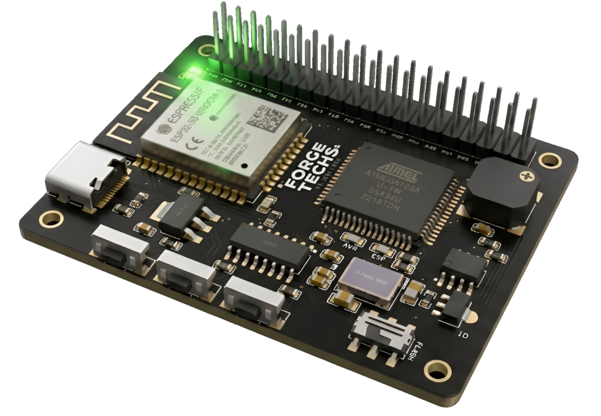

<h1 align="center">LUMINO UNO</h1>

An Open Source Dual Cored Micro-controller which can flash two different firmware in one board.

  

# Features
- **ESP32 WROOM 32 N4** for Wi-Fi and IoT connectivity
- Dual MCU communication via **UART**
- **ATmega128AU** for real-time hardware control
- Toggle Switch to convert the mode for the Flash
- Built-in startup and feedback sound system
- Type-C connectivity

# Softwares

   

# Comparison Table

| Feature                 | ESP32          | Arduino Uno        | Lumino Uno       |
|-------------------------|----------------|----------------|------------------|
| Internet        | ✅ Yes         | ❌ No          | ✅ Yes           |
| Bluetooth               | ✅ Yes         | ❌ No          | ✅ Yes           |
| Real time control       | ⚠️ Limited     | ✅ Yes         | ✅ Yes           |
| Sensor handling         | ⚠️ Limited     | ✅ Yes         | ✅ Yes           |
| Motor or Relay control   | ⚠️ Limited     | ✅ Yes         | ✅ Yes           |
| Processing power        | ✅ High        | ❌ Low         | ✅ Balanced      |
| Hardware stability      | ⚠️ Medium      | ✅ High        | ✅ High          |
| Ease of use             | ✅ Easy        | ✅ Easy        | ⚠️ Moderate      |
| Multitasking            | ✅ Efficient   | ❌ Hard          | ✅ Yes           |
| Power consumption       | ⚠️ Higher      | ✅ Low         | ⚠️ Higher        |
| Best use case           | IoT, Web apps | Control systems | Full systems     |

# How to Flash
Dont just over confuse it. its compilicated but not hard. its just a esp and atmega.. 

**FLASH TO ATMEGA**
- Select board Arduino Uno
- Flash Switch to left
- Upload code through USB C
You AVR is now coded, dont unplug it yet

**FLASH TO ESP**
- Select Board ESP32 Dev Module
- Flash Switch to right
- Upload code
- Press boot buttom while uploading
Your board is now complet
## 3D model (can't uploade due to above 25mb)
[3D Model](https://cdn.hackclub.com/019e3a1e-7bf6-7cc7-b24b-c62ca8a7e5d8/3d%20model.step)

## Zine page 

  

